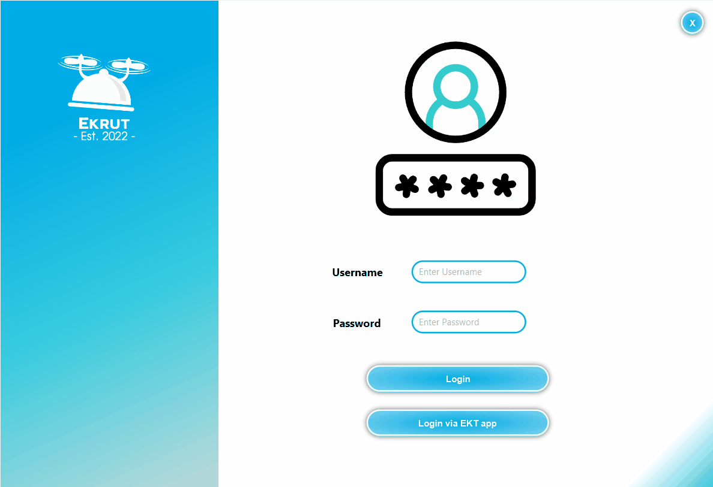
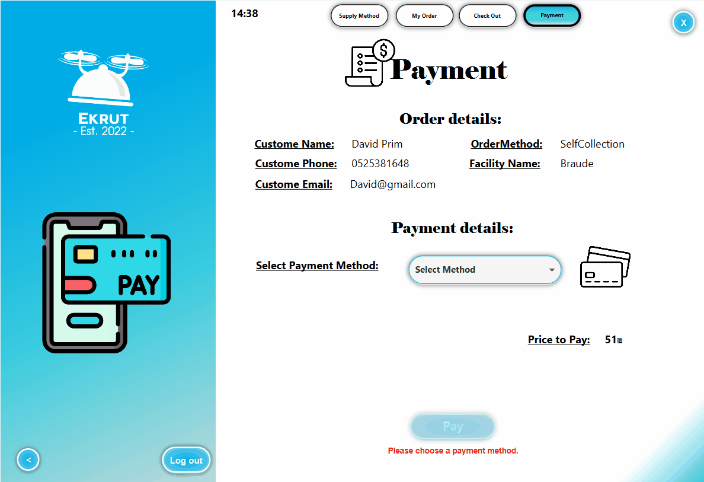
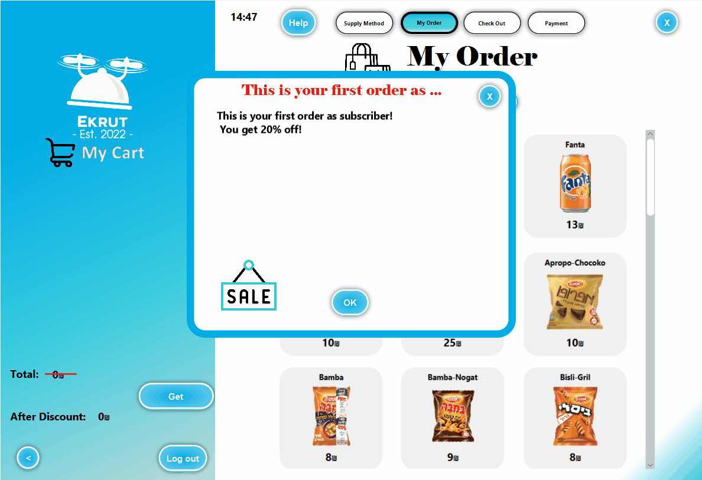

# 🛍 Ekrut-Server-Client-Shop

## 📝 Description

In this project, I utilized my Java programming skills to develop a client-server application using the Object Client Server Framework (OCSF) to manage critical business information for a company. Specifically, I designed and implemented a user-friendly interface for managing product stock, orders, user roles, and customer orders. The software also allowed clients to view the shop and place orders securely. Each user had a specific role assigned to them with certain permissions to perform designated actions within the software. For example, a delivery employee could mark a delivery order as delivered. All data was securely stored in a MySQL database on the server-side. Through this project, I gained valuable experience in software development, user interface design, and database management, which I believe will be valuable in future roles as a software developer.

## 📷 Screenshots

